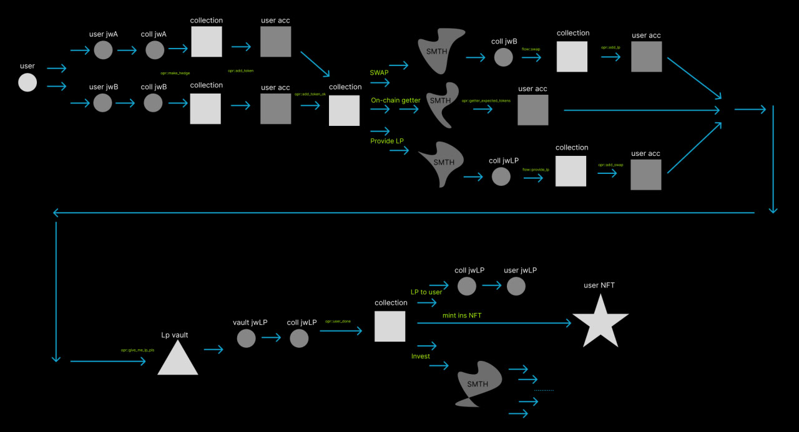

# lp20Proxy-hedge

За Lock - ничего?
За Lock - успеха!

## Lp20Proxy - это надстройка над стандартными пулами Ston.fi(в данном примере) или над любой другой DEX.

Позволяет страховать часть своих средств при поставке ликвидности в пул за счёт продвинутых инвестиционных стратегий!

Схема: от юзера - до юзера, что же происходит с того момента, как юзер отдал свои средства до получения им всех его LP-токенов

## Пример реальной транзакции в testnet:

https://testnet.tonviewer.com/transaction/db4084e6c9aebd92d16e429d74a59ce322d77edce09fcf1f20c7b4c6f5154fb1

Данная цепочка транзакций демонстрирует модель взаимодействий множества смарт-контрактов, с помощью которых  получилось воплотить в жизнь простую идею - поставка ликвидности с хеджированием.

## Что же происходит?

Человек пересылает пару активов на Lp20ProxyCollection, после этого, с помощью отельных смарт-контрактов аккаунтов конкретного человека, происходит внутренняя логика.

А именно - 80% от обоих его активов поставляются в пул(т.е 80% токенов и 80% USDT). Далее 20% токенов свапаются в USDT(т.е, грубо говоря, открывается шорт позиция, происходит хеджирование) и идут на NFT Item, подтверждающий страховку конкретного человека. 20% в USDT реинвистируются.

## А что же с LP токенами? 

За забранные 20% активов у пользователя, из LP vault запрашивается нужное количество токенов с помощью onchain геттеров(для того, чтобы вернуть пользователю 100% его LP-токенов).

Таким образом, пользователь получает то же количество LP-токенов, что получил бы, если бы поставил ликвидность стандартным образом, но в дополнение у него появляется обеспечение его активов на целый год, если поставленный им в пул токен упадёт в цене больше, чем на 20%.

## А что же с LP vault?

Нет, токены в нём не просто иссякнут со временем, туда буду поступать LP-токены, полученные за поставленную реинвестированную ликвидность с 20% от USDT, взятых в самом начале!

TAIGA Labs

